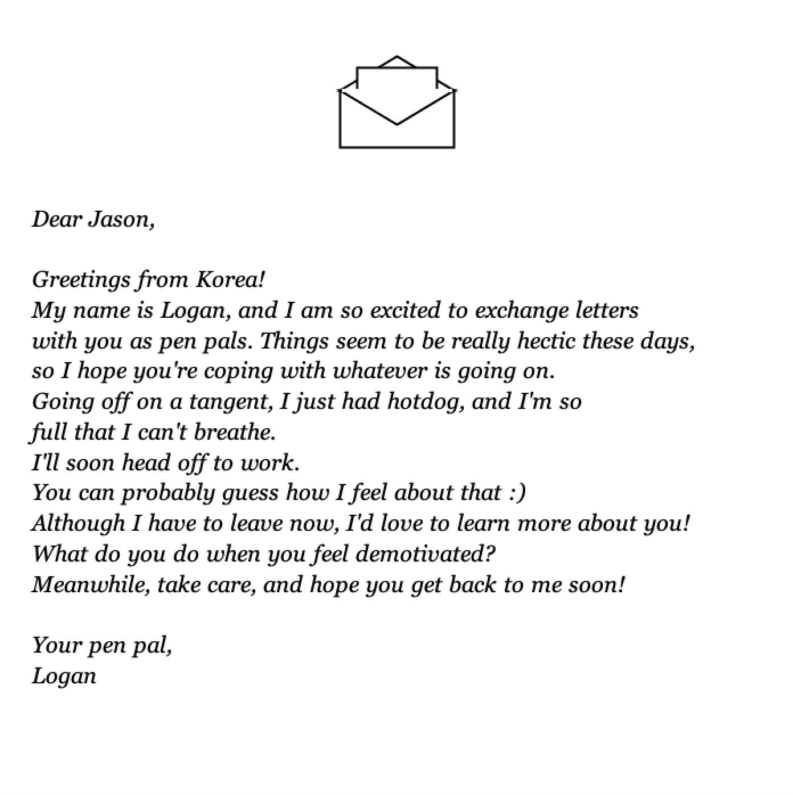

## [Generative Text] Letter from a Pen Pal

**[Link to Video](https://youtu.be/nStybjdui4s)**

### Description
My program generates varying version of a pen pal letter whenever the code runs. 
The user gets the letter by writing down his/her name on the opening page and pressing enter. The name written down becomes the receiver, and several words/phrases of the letter are determined randomly based on the different options listed in table in the .csv file. 
The layout of the letter is the following:

> Dear __user-input name__,

> Greetings from __country__!
My name is __sender__, and I am so excited to exchange letters with you as pen pals. Things seem to be really hectic these days, so I hope you're coping with whatever is going on.
Going off on a tangent, I just had __food__, and I'm so full that I can't breathe.
I'll soon head off to __activity__. 
You can probably guess how I feel about that :)
Although I have to leave now, I'd love to learn more about you!
__question__.
Meanwhile, take care, and hope you get back to me soon!

Your pen pal,
__sender__

'''

The five fill-in-the-blanks (country, food, activity, question, and sender) are the ones being randomly selected from the .csv file.

**Challenges**

I don't think my program is particularly confusing. However, one thing to keep in mind is that it uses the "Table" class to produce the string values from the .csv file, because the file has a table with multiple columns.
On the other hand, the code behind user-input name is straightforward, with the string value "name" changing based on what key is pressed. The use of boolean for using the "enter" key to move onto the next page (letter) is also noteworthy. Still, I would like to know how I can re-code the user-input name part so that deleting the letters with the back button is possible. I've been getting errors on the program whenever I pressed the back-button. 

### Images

### References
- https://wp.nyu.edu/abudhabi_im_intro/meeting-18-week-9-long-day-thursday-april-9-240-520/
- https://github.com/paredesfluffyshark/Intro-To-IM/tree/master/Text-Generator
- https://forum.processing.org/two/discussion/20882/very-basic-question-how-to-create-an-input-text-box
