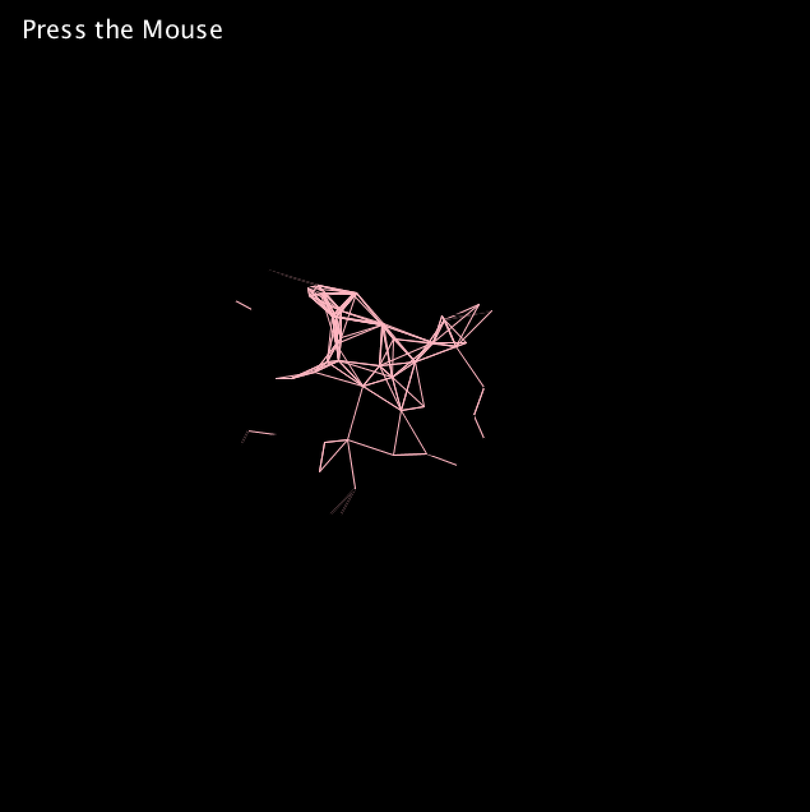

## Experimentation

**[Link To Video](https://youtu.be/gNRvoTv4CWc)**

### Description
In accordance to the assignment instructions, I experimented with Prof. Aaron's code. Eventually, I modified the program so that the user only sees a portion of the "web" (strokes located near the mouse) unless he/she presses the mouse, which is when the entirety of the "web" appears.
This gave a different aesthetic to the overall piece, which is no longer white and red but a combination of black, white/gray, and pink. Also, I made it so that the direction of the strokes' movement is constant at -1, instead of using the coin flip. Lastly, acceleration/movement is only given to the strokes that are "far enough" from the mouse—this is essentially opposite to the original code. 

### Images

### References
- https://github.com/aaronsherwood/introduction_interactive_media/blob/master/processingExamples/drawing/connectedLines/connectedLines.pde
