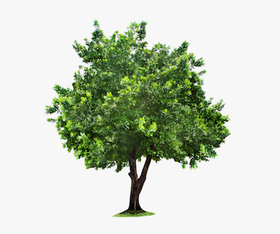
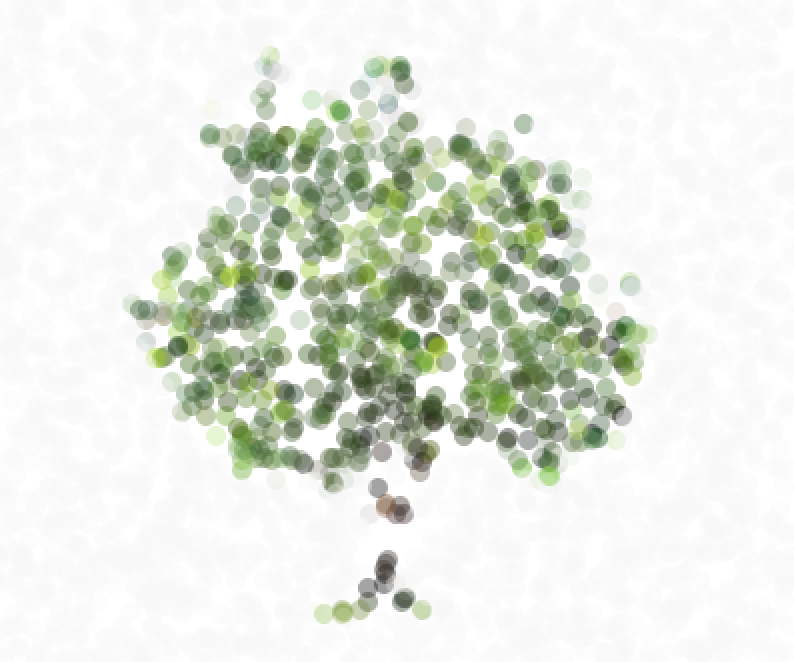
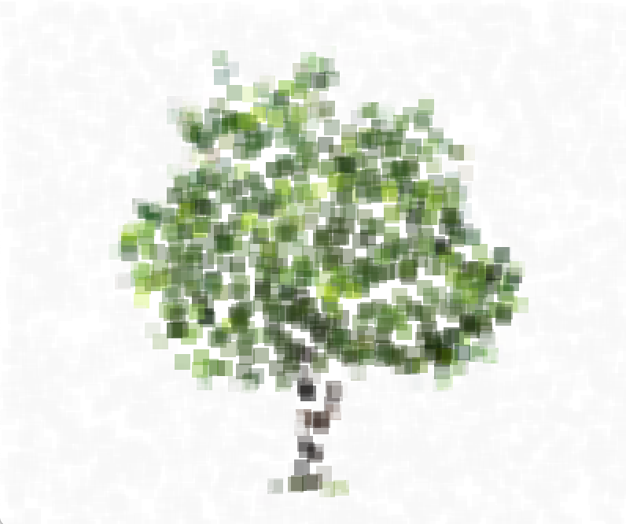
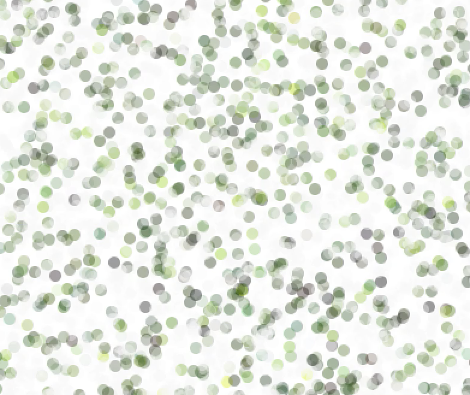

## Dynamic Pointillism

**[Link To Video](https://youtu.be/1ViR6w8pGng)**

### Description
For this assignment, I pointilized a photo of a tree and made it dynamic. More specifically, the differently-colored dots/squares are placed randomly at first, but when the user presses any key or clicks on the screen, the dots/squares move to their supposed-to-be positions, properly pointillizing and thus resembling the image being used. 
I learned how to pointillize an image using processing mainly through the website tutorial (link below). 

### Images
  

Transition
 

### References
- https://processing.org/tutorials/pixels/
- https://www.kindpng.com/imgv/iRJhR_tree-png-image-tree-png-for-photoshop-transparent/
