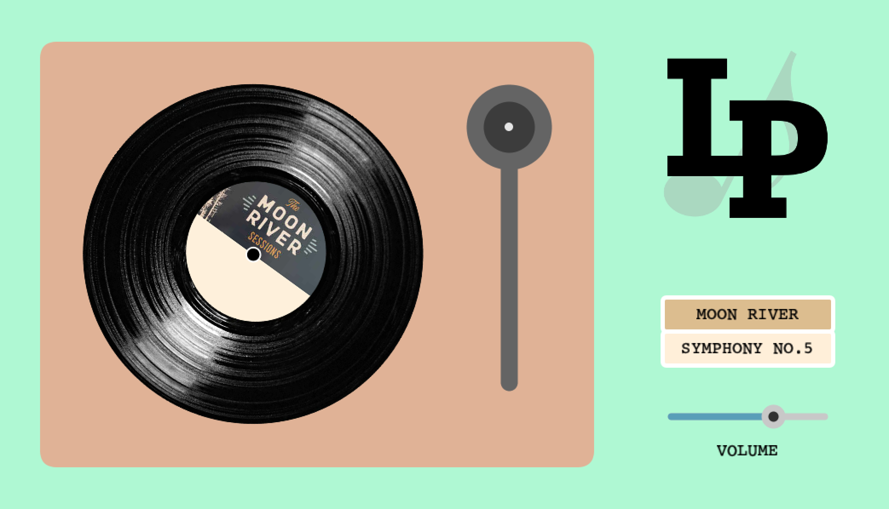
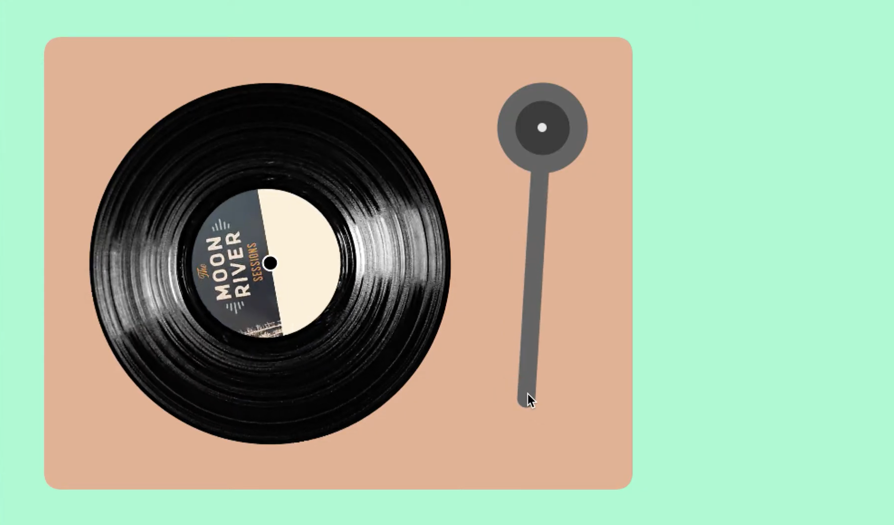
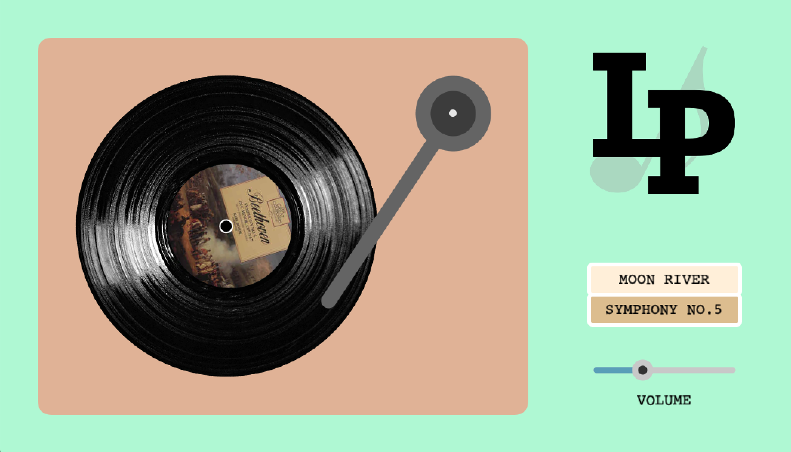

## Interactive Turntable

**[Link to Video](https://youtu.be/iHk6PVKw8LY)**

 

### Description

My final project "Interactive Turntable" is an emulation of a vinyl record player (turntable) on Processing. The user can use the turntable just as they would use it in real life, which is by placing the tonearm on the LP record. The tonearm moves closer to the center of the record as the playing continues. The user can change the start time of the music by moving the tonearm to different parts of the LP record and can stop the music by removing the tonearm from it. The turntable also contains a volume slider that can be used to adjust the sound volume.

Two soundtracks, namely "Moon River" sung by Audrey Hepburn and "Symphony No.5" composed by Beethoven, are available. Either song can be chosen by clicking on the according buttons.

### Process

After coming up with the idea of digitally creating a turntable, I looked for relevant information that would help me in coding. I first looked at the anatomy of a turntable:

 

Then, I was able to find an example of a digital interactive turntable on a [website](https://tympanus.net/Development/RecordPlayer/). Based on the information I gathered, I determined the key commponents of a turntable. I decided to use object-oriented programming (OOP) and create 4 classes: Turntable, ToneArm, MusicSelector (buttons for choosing the song), and Volume (controller/sider).

The Turntable class is for displaying the turntable (except for the tonearm) and the rotating LP record. The class thus has two functions—display() and displayLP().
The Tonearm class is arguably the most important class since its purpose is to enable the users to manipulate the tonearm for playing or stopping the music. It has one display() function, and the tonearm's location in relation to to the LP record determines whether the song is playing and, if so, at what time. A timer is also incorporated in the class so that the edge of the tonearm moves closer to the center of the LP record as the playing continues, a feature that exists in a real-world turntable.

After making the two classes, I could structure the turntable with its basic functions by initiating according objects. At this point, my work turned out to be [this video](https://www.youtube.com/watch?v=8oX1fq3wJGY).

 

I wanted to put more features onto my turntable. Therefore, I added two musicselector buttons and a volume controller.
The Musicselector class creates buttons that users can click on to select one out of the two available songs. This changes the recording being played as well as the LP record visuals.
The Volume class is for creating a volume slider/controller. The function is pretty straightforward, with the user moving the holder of the volume slider for adjusting the volume.

Aside from the technicalities of the code, I styled the work to make it visually appealing and emphasize that it is a digital re-creation of an analog/old-fashioned object. I also created and displayed an "LP" logo with a music note as the background image. 

### Potential Improvements

Generally, I'm satisfied with my final product because it includes most features and functions that I aimed to incorporate. However, there are some improvements I can make.

My first concern is regarding how tonearm automatically moves closer to the center of the LP record when it's on the record. I wasn't able to make it so that the tonearm's movement is in direct correlation to the time of the music. When the user manually places the tonearm on a certain location, the music's starting time is calculated based on the distance between the tonearm and the record's center. However, this is not the case when the tonearm is moving by itself. For this, I used a timer instead of mapping the actual song duration to the movement of the tonearm. 
Luckily, the duration of the two songs in the current program ("Moon River" and "Symphony No.5") is similar, so the movement of the tonearm generally correlates to the music time. But, I would like to eventually change this so that they are directly related. 

Second, I could've added other optional features/components to the turntable. One feature that I want to include is an audio visualizer so that the final work seems a bit more dynamic and lively. Furthermore, for selecting the song to play, I can make it more entertaining by having the user actually "replace" the LP record himself/herself by dragging the record to the turntable, instead of simply utilizing buttons (which is simpler).

### Photos

 
 

### References

idea:
- https://tympanus.net/codrops/2016/06/15/interactive-record-player/
- https://thevinylfactory.com/features/turntable-anatomy-an-interactive-guide-to-the-key-parts-of-a-record-player-2/
 
code:
- https://processing.org/reference/libraries/sound/SoundFile.html
- https://processing.org/reference/map_.html
- https://processing.org/reference/libraries/sound/SoundFile.html
- http://learningprocessing.com/examples/chp10/example-10-10-rain-catcher-game
- http://learningprocessing.com/examples/chp10/example-10-04-timer
- https://www.youtube.com/watch?v=lalHizFnzp8 
- https://forum.processing.org/one/topic/rotate-image.html
- https://forum.processing.org/two/discussion/14433/rotate-line-in-such-a-way-that-one-point-is-in-the-middle-of-the-canvas-and-other-follows-the-mouse
 
images/visuals:
- https://incrediblecaketoppers.co.uk/products/personalised-photo-and-message-lp-record-vinyl-fondant-cake-topper
- https://www.discogs.com/Beethoven-Vienna-Symphony-Orchestra-Otto-Klemperer-Symphony-No-5-In-C-Minor-Opus-67/release/3561656
- https://www.discogs.com/ko/Various-The-Moon-River-Sessions/release/13845890
- https://htmlcolorcodes.com/color-picker/
 
songs:
- https://www.youtube.com/watch?v=Mjkl4rfDy_Y - Moon River
- https://www.youtube.com/watch?v=ttjczsb__mU - Symphony No.5
