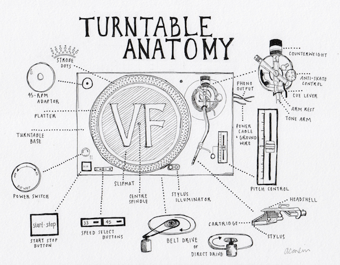

## Interactive Turntable

For my final project, I plan to emulate a vinyl record player (turntable) on Processing. Through this, I will figure out how I can aesthetically re-create an analog/old-fashioned object through the software. 

The online turntable will have the following features:
- multiple soundtracks are available
- when the lp record for a specific soundtrack is placed on the turntable, the lp will start spinning
- when the arm of the turntable is moved to the record, the soundtrack will begin playing
- at what point the soundtrack starts will depend on exactly where the arm is placed
- there will be a volume controller
- the soundtrack can be stopped by removing the arm from the lp

I will definitely be using audio, images, and OOP while programming. I am planning to add other features if I get enough time to do so. 

### Image for Brainstorming
 

### References
- https://thevinylfactory.com/features/turntable-anatomy-an-interactive-guide-to-the-key-parts-of-a-record-player-2/
- https://tympanus.net/Development/RecordPlayer/
